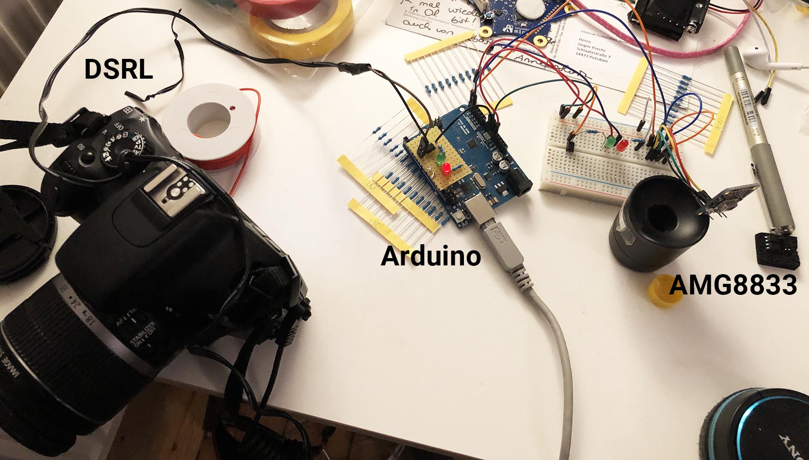

# Thermal camera timelapse

This is a small arduino project to create timelapse videos to capture the painting process.
I really like to watch timelapse for digital art and paintings, e.g. photoshop, where you have a screen capture and therefore see no hand, only the magically appearing brush strokes. Usually when I want to see timlapses of classical oilpainting the painters body or hand is in between. Regardless the less meditative part seeing an annyoing hand swiping over the canvas, it's not good to use the video material for projection or other purposes - maybe you could even train your own style and painting development to an AI!?

----

## Hardware

- Arduino Uno
- Optocoupler, I used an [PC817C](https://pdf1.alldatasheet.com/datasheet-pdf/view/43376/SHARP/PC817C.html)
- Resistors (100 Ohm)
- 8x8 IR Grid Eye Thermal Camera AMG8833
- two LEDs
	1. green: indicating trigger
	2. red: indicating person in sensor range
-  2.5 mm jack remote release cable with 3 poles for the DSLR
- DSLR. I used my Canon EOS 550D 

## Software

- Arduino IDE
  - Load the Adafruit  [AMG8833 Library](https://github.com/adafruit/Adafruit_AMG88xx)
  - If necessary install the [BusIO Library](https://github.com/adafruit/Adafruit_BusIO)
- AfterEffects or any other cutting software to make a timelapse out of frames

----

## Wiring

### Triggering the camera remote with the Arduino

A lot if inspiration and know-how I've found in [this article by elbebilder.de](  https://technik.elbebilder.de/2012/12/03/kamera-mit-arduino-fernsteuern/#:~:text=Dazu%20wird%20der%20Eingang%20des,Zeit%20auf%20HIGH%20geschaltet%20werden)

I chose an Optocoupler PC817C, I have to admit, that I have no clue about how different models will differ. It simply has to isolated two circuits galvanically from each other, by sending the signal over. My first idea was to use an relay, still they work electromechaincally and not optically, are much slower and make a tiny yet annoying noise, if you consider making up to thousands of frames with the camera. 
The Optcoupler has a forward voltage of 1.2 a green LED of 2.2, and both draw a current of 20mA. I put them in row, to see when the optocoupler closes the circuit. Both LEDs will draw 40mA from the same pin. **Consider that this is the absolute maximum of an Arduino I/O Pin!**
Here is the calculation:

```5 Vs - (1.2Vf + 2.2 Vf) / 0.02 mA = 80 Ohms```

TL;DR: I used an 100 Ohms Resistor and that works fine.

### Setting up the AMG8833

Connecting the AMG8833 is quite simple. It uses an I2C protocol thus it needs to be connected to the serial clock (A5) and serial data (A4) pins of the arduino such as the 5V and ground (GND). The sensor can also be powered with 3.3 V.


| Arduino   | AMG8833  |
| --------- | -------- |
| 5V / 3.3V | VIN / 3V |
| GND       | GND      |
| A4        | SDA      |
| A5        | SCL      |



----

## Programming

### Limiting the FOV of the AMG8833

The Infrad grid Eye Sensor has a 60 degree viewing angle (FOV). In my test 60 degrees seem a little bit to less, because I could almost stand in 90 degree next to the sensor an it could still detect my thermal radiation. That was a little exaggerated, but 60 degree is much more as I expected and I only want to cover a painting, and a little beneath. 

So I chose to limit it's FOV programmatically, by checking only the inner 4 rows of pixels. Because it is not a matrix (2D array) but a simple array, the rows or columns can be checked by modulo or division by the length of row or column. I've just tested both to figure out, wether the sensor is oriented horizontally or vertically. **Don't forget to round if you chose division! ;)**

```
    if (
      round(i % 8) != 0
      || round(i % 8) != 7
      || round(i % 8) != 1
      || round(i % 8) != 6) {
      if (pixels[i - 1] >= initialTemperature[i - 1] + threshold) {
        sum += 1;   // if one pixel is above threshold add 1
      }
    }
```

### Functions

- **initialTemp()**
  caluclates the initial temperature of the environment and stores it to an array (8x8 = 64)
  
- **calcMaxTemp()**
  returns a float: the highest temperature of all pixels
  
- **calcAverageTemp(amount, interval)**
  returns a float: calculates the average temperature of all pixels in multiple test cycles. Parameter amount is the number of cycles, and interval the time between the cycles.
  
- **personInside()**
  returns a boolean: true, if one of each pixel is above the temperature threshold

----

## Result


https://user-images.githubusercontent.com/72135430/188613982-f0d9bab1-b28f-4c92-a2a1-ba16c9c7f24c.mp4

